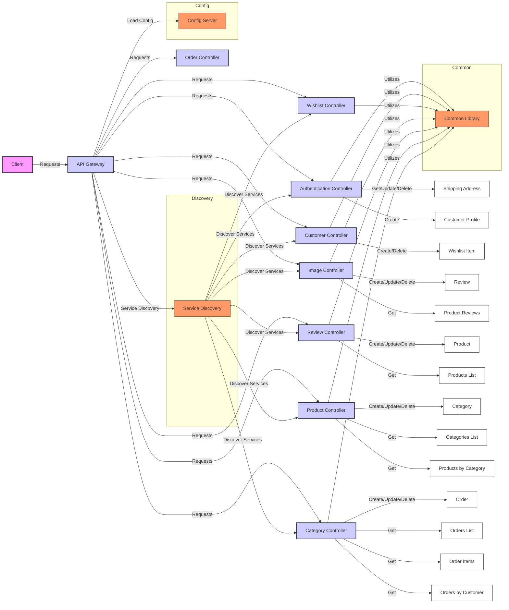

```mermaid

graph LR
    A[Client] -->|Requests| B[API Gateway]
    B -->|Requests| C[Authentication Controller]
    B -->|Requests| D[Customer Controller]
    B -->|Requests| E[Wishlist Controller]
    B -->|Requests| F[Image Controller]
    B -->|Requests| G[Review Controller]
    B -->|Requests| H[Product Controller]
    B -->|Requests| I[Category Controller]
    B -->|Requests| J[Order Controller]

    C -->|Get/Update/Delete| K[Shipping Address]
    C -->|Create| L[Customer Profile]
    
    D -->|Create/Delete| M[Wishlist Item]
    
    F -->|Create/Update/Delete| N[Review]
    F -->|Get| O[Product Reviews]

    G -->|Create/Update/Delete| P[Product]
    G -->|Get| Q[Products List]

    H -->|Create/Update/Delete| R[Category]
    H -->|Get| S[Categories List]
    H -->|Get| T[Products by Category]

    I -->|Create/Update/Delete| U[Order]
    I -->|Get| V[Orders List]
    I -->|Get| W[Order Items]
    I -->|Get| X[Orders by Customer]

    subgraph Discovery
        Y[Service Discovery]
    end

    subgraph Config
        Z[Config Server]
    end

    subgraph Common
        AA[Common Library]
    end

    B -->|Service Discovery| Y
    Y -->|Discover Services| C
    Y -->|Discover Services| D
    Y -->|Discover Services| E
    Y -->|Discover Services| F
    Y -->|Discover Services| G
    Y -->|Discover Services| H
    Y -->|Discover Services| I

    B -->|Load Config| Z
    C -->|Utilizes| AA
    D -->|Utilizes| AA
    E -->|Utilizes| AA
    F -->|Utilizes| AA
    G -->|Utilizes| AA
    H -->|Utilizes| AA
    I -->|Utilizes| AA

    style A fill:#f9f,stroke:#333,stroke-width:2px
    style B fill:#ccf,stroke:#333,stroke-width:2px
    style C fill:#ccf,stroke:#333,stroke-width:2px
    style D fill:#ccf,stroke:#333,stroke-width:2px
    style E fill:#ccf,stroke:#333,stroke-width:2px
    style F fill:#ccf,stroke:#333,stroke-width:2px
    style G fill:#ccf,stroke:#333,stroke-width:2px
    style H fill:#ccf,stroke:#333,stroke-width:2px
    style I fill:#ccf,stroke:#333,stroke-width:2px
    style J fill:#ccf,stroke:#333,stroke-width:2px
    style K fill:#fff,stroke:#333,stroke-width:1px
    style L fill:#fff,stroke:#333,stroke-width:1px
    style M fill:#fff,stroke:#333,stroke-width:1px
    style N fill:#fff,stroke:#333,stroke-width:1px
    style O fill:#fff,stroke:#333,stroke-width:1px
    style P fill:#fff,stroke:#333,stroke-width:1px
    style Q fill:#fff,stroke:#333,stroke-width:1px
    style R fill:#fff,stroke:#333,stroke-width:1px
    style S fill:#fff,stroke:#333,stroke-width:1px
    style T fill:#fff,stroke:#333,stroke-width:1px
    style U fill:#fff,stroke:#333,stroke-width:1px
    style V fill:#fff,stroke:#333,stroke-width:1px
    style W fill:#fff,stroke:#333,stroke-width:1px
    style X fill:#fff,stroke:#333,stroke-width:1px
    style Y fill:#f96,stroke:#333,stroke-width:1px
    style Z fill:#f96,stroke:#333,stroke-width:1px
    style AA fill:#f96,stroke:#333,stroke-width:1px
```
